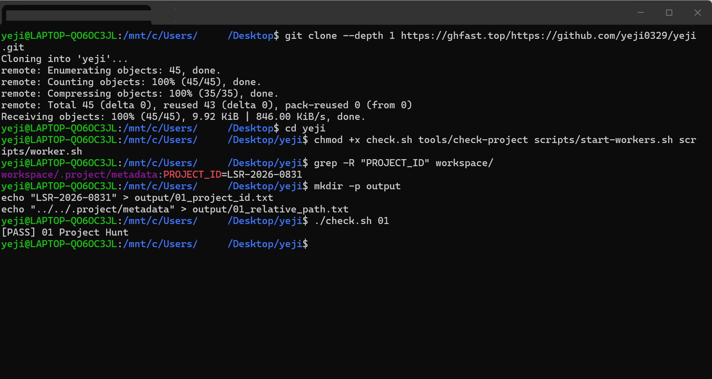
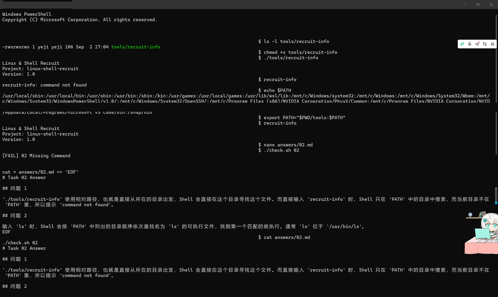
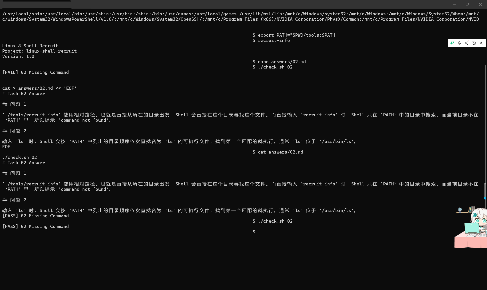
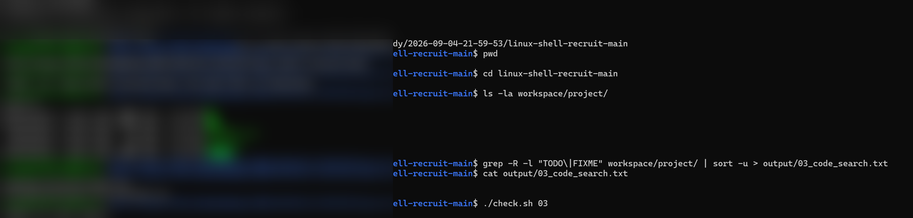

# Linux Shell 招新学习笔记

## Task 01 - Project Hunt

### 题目要求
在 `workspace/` 目录下找到项目编号 `PROJECT_ID`，并将其写入 `output/01_project_id.txt`；同时假设当前目录为 `workspace/src/utils/`，写出保存 `PROJECT_ID` 文件的相对路径，写入 `output/01_relative_path.txt`。

### 解题过程
1. 使用 `ls -la workspace/` 查看所有文件（包括隐藏文件）。
2. 使用 `grep -R "PROJECT_ID" workspace/` 递归搜索包含项目编号的文件。
3. 发现文件位于 `workspace/.project/metadata`，内容为 `PROJECT_ID=LSR-2026-0831`。
4. 创建输出目录：`mkdir -p output`。
5. 写入项目编号：`echo "LSR-2026-0831" > output/01_project_id.txt`。
6. 写入相对路径：`echo "../../.project/metadata" > output/01_relative_path.txt`。
7. 运行判题程序：`./check.sh 01`，结果通过。

### 运行结果截图



### 学习感悟

> （此处待补充）

---
## Task 02 - Missing Command

### 题目要求
给 `tools/recruit-info` 添加可执行权限；回答题目中的两个问题并写入 `answers/02.md`；在不移动文件、不修改 `.bashrc`、不使用 `sudo` 的前提下，临时让当前 Shell 可以直接输入 `recruit-info` 执行该脚本。

### 解题过程
1. `chmod +x tools/recruit-info` 给脚本添加可执行权限，用 `ls -l` 验证权限变为 `-rwxrwxrwx`。
2. 用 `./tools/recruit-info`（相对路径）可以执行；但直接输入 `recruit-info` 提示 `command not found`，因为当前目录不在 `PATH` 中。
3. `echo $PATH` 查看环境变量，确认 PATH 中列出的目录不包含当前目录。
4. `export PATH="$PWD/tools:$PATH"` 把 `tools` 目录临时加入当前会话的 `PATH`。
5. 直接输入 `recruit-info` 成功执行，输出脚本内容。
6. 用 `cat > answers/02.md << 'EOF'` 的方式写入两个问题的答案（相对路径与 `PATH` 查找机制）。
7. 运行判题程序：`./check.sh 02`，结果通过。

### 运行结果截图





### 学习感悟

> （此处待补充）

---

## Task 03 - Code Search

### 题目要求
在 `workspace/project/` 下递归搜索包含 `TODO` 或 `FIXME` 的源代码文件，将文件路径列表写入 `output/03_code_search.txt`，要求路径按字典序排列且不重复。

### 解题过程
1. 先查看项目结构：`ls -la workspace/project/`。
2. 使用 `grep -R -l "TODO\|FIXME" workspace/project/` 递归搜索，`-l` 只输出包含关键字的文件路径。
3. 用管道 `| sort -u` 对结果排序并去重。
4. 将结果重定向到 `output/03_code_search.txt`。
5. 用 `cat output/03_code_search.txt` 检查输出。
6. 运行判题程序：`./check.sh 03`，结果通过。

### 运行结果截图



### 学习感悟

> （此处待补充）

---

## Task 04 - Log Statistics

### 题目要求
对 `logs/server.log` 中的 ERROR 日志进行统计：
1. 统计 ERROR 总条数，写入 `output/04_error_count.txt`。
2. 列出所有产生过 ERROR 的用户名，写入 `output/04_error_users.txt`。
3. 找出出现次数最多的错误码，写入 `output/04_top_code.txt`。

日志格式示例：
```text
2026-08-31 10:02:17 ERROR user=bob code=500
```

### 解题过程

#### 任务 1：统计 ERROR 条数
```bash
grep "ERROR" logs/server.log | wc -l > output/04_error_count.txt
```
`grep` 过滤出 ERROR 行，`wc -l` 统计行数。结果为 `7`。

#### 任务 2：列出所有 ERROR 用户名
```bash
grep "ERROR" logs/server.log | cut -d' ' -f4 | cut -d'=' -f2 | sort -u > output/04_error_users.txt
```
- `cut -d' ' -f4`：按空格切分，取第 4 列（`user=bob`）。
- `cut -d'=' -f2`：按等号切分，取等号右边（`bob`）。
- `sort -u`：排序并去重。

结果为 `alice`、`bob`、`carol`、`dave`。

#### 任务 3：找出出现次数最多的错误码
```bash
grep "ERROR" logs/server.log | cut -d' ' -f5 | cut -d'=' -f2 | sort | uniq -c | sort -nr | head -1 | awk '{print $2}' > output/04_top_code.txt
```
- `cut -d' ' -f5`：取第 5 列（`code=500`）。
- `cut -d'=' -f2`：取错误码数字。
- `sort | uniq -c`：统计每个错误码出现次数。
- `sort -nr`：按次数数字倒序排列。
- `head -1`：取第一行（次数最多的）。
- `awk '{print $2}'`：只取错误码数字。

结果为 `500`。

#### 检查
```bash
./check.sh 04
```
结果通过。

### 运行结果截图


### 学习感悟

> （此处待补充）

---

