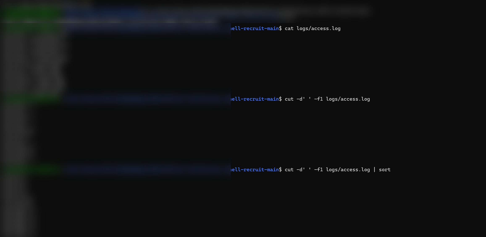
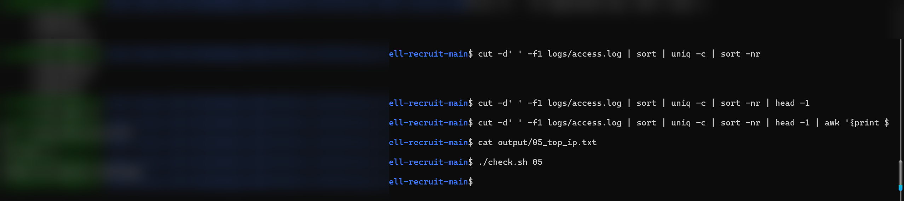
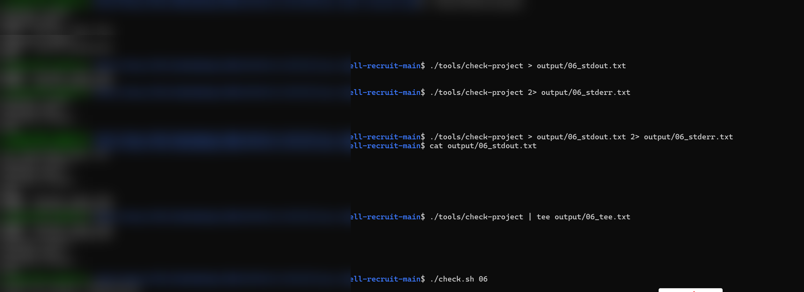
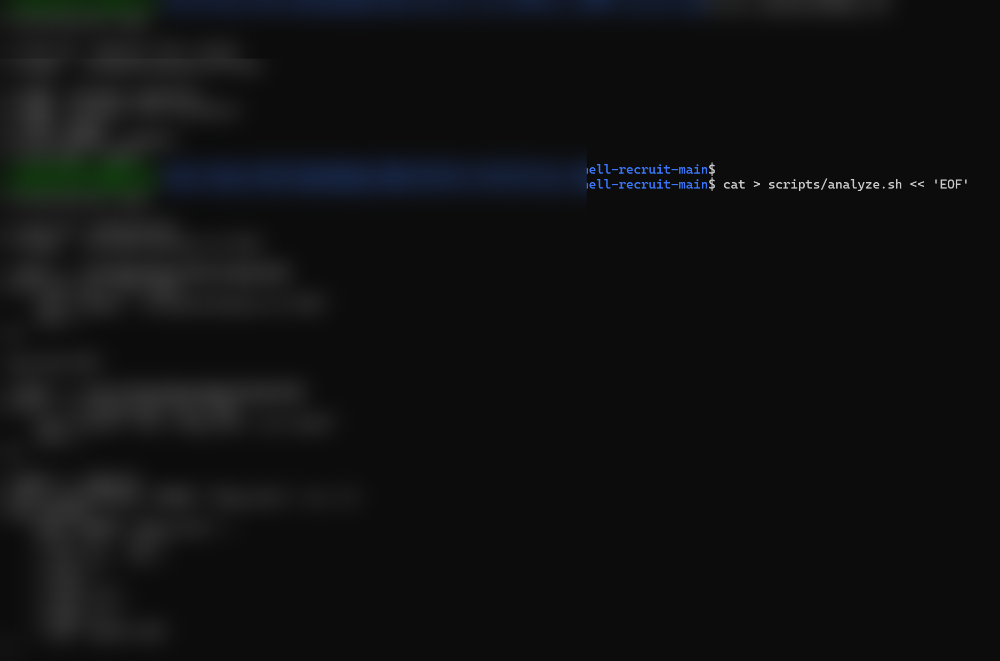
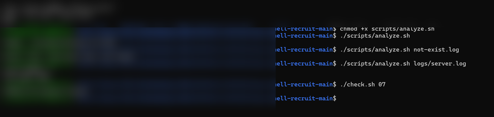
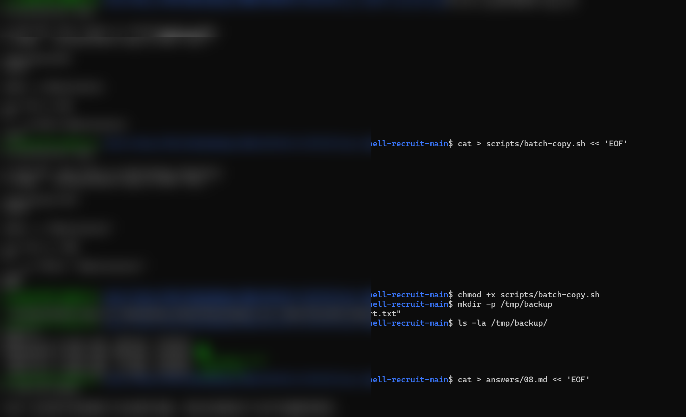
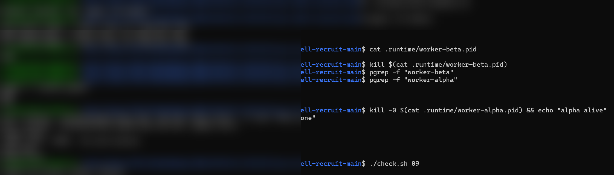

# Linux Shell 招新学习笔记

## Task 01 - Project Hunt

### 题目要求
在 `workspace/` 目录下找到项目编号 `PROJECT_ID`，并将其写入 `output/01_project_id.txt`；同时假设当前目录为 `workspace/src/utils/`，写出保存 `PROJECT_ID` 文件的相对路径，写入 `output/01_relative_path.txt`。

### 解题过程
1. 使用 `ls -la workspace/` 查看所有文件（包括隐藏文件）。
2. 使用 `grep -R "PROJECT_ID" workspace/` 递归搜索包含项目编号的文件。
3. 发现文件位于 `workspace/.project/metadata`，内容为 `PROJECT_ID=LSR-2026-0831`。
4. 创建输出目录：`mkdir -p output`。
5. 写入项目编号：`echo "LSR-2026-0831" > output/01_project_id.txt`。
6. 写入相对路径：`echo "../../.project/metadata" > output/01_relative_path.txt`。
7. 运行判题程序：`./check.sh 01`，结果通过。

### 运行结果截图


### 学习感悟

学到了怎么找文件，明白了 `cd` 的含义；知道了用 **`chmod +x`** 添加可执行权限、用 **`grep -R`** 递归搜索文本；还明白了以 `.` 开头的目录是隐藏目录，学会了用 **`ls -la`** 查看所有文件；同时掌握了 **`mkdir -p`** 创建目录、**`echo`** 把内容写进文件。一开始对这些字母感到迷糊，但当我一步一步弄清每个字母代表什么、为什么要这么做之后，第一题该怎么去找隐藏文件就完全清楚了。

---

## Task 02 - Missing Command

### 题目要求
给 `tools/recruit-info` 添加可执行权限；回答题目中的两个问题并写入 `answers/02.md`；在不移动文件、不修改 `.bashrc`、不使用 `sudo` 的前提下，临时让当前 Shell 可以直接输入 `recruit-info` 执行该脚本。

### 解题过程
1. `chmod +x tools/recruit-info` 给脚本添加可执行权限，用 `ls -l` 验证权限变为 `-rwxrwxrwx`。
2. 用 `./tools/recruit-info`（相对路径）可以执行；但直接输入 `recruit-info` 提示 `command not found`，因为当前目录不在 `PATH` 中。
3. `echo $PATH` 查看环境变量，确认 PATH 中列出的目录不包含当前目录。
4. `export PATH="$PWD/tools:$PATH"` 把 `tools` 目录临时加入当前会话的 `PATH`。
5. 直接输入 `recruit-info` 成功执行，输出脚本内容。
6. 用 `cat > answers/02.md << 'EOF'` 的方式写入两个问题的答案（相对路径与 `PATH` 查找机制）。
7. 运行判题程序：`./check.sh 02`，结果通过。

### 运行结果截图


### 学习感悟

学会了 `PATH` 环境变量，知道用 `export` 可以临时修改 `PATH`；顺带把绝对路径和相对路径也彻底弄清楚了。

---

## Task 03 - Code Search

### 题目要求
在 `workspace/project/` 下递归搜索包含 `TODO` 或 `FIXME` 的源代码文件，将文件路径列表写入 `output/03_code_search.txt`，要求路径按字典序排列且不重复。

### 解题过程
1. 先查看项目结构：`ls -la workspace/project/`。
2. 使用 `grep -R -l "TODO\|FIXME" workspace/project/` 递归搜索，`-l` 只输出包含关键字的文件路径。
3. 用管道 `| sort -u` 对结果排序并去重。
4. 将结果重定向到 `output/03_code_search.txt`。
5. 用 `cat output/03_code_search.txt` 检查输出。
6. 运行判题程序：`./check.sh 03`，结果通过。

### 运行结果截图


### 学习感悟

再一次加深了对 **`grep -R -l`** 的理解——搜索相应文件后只显示文件名；还学会了用 **`sort -u`** 排序并去掉重复行；知道了用管道把上一个输出变成下一个输入，把每一步串起来；同时也明白了 **`cat`** 的含义是把文件内容打印到屏幕。

---

## Task 04 - Log Statistics

### 题目要求
对 `logs/server.log` 中的 ERROR 日志进行统计：
1. 统计 ERROR 总条数，写入 `output/04_error_count.txt`。
2. 列出所有产生过 ERROR 的用户名，写入 `output/04_error_users.txt`。
3. 找出出现次数最多的错误码，写入 `output/04_top_code.txt`。

日志格式示例：
```text
2026-08-31 10:02:17 ERROR user=bob code=500
```

### 解题过程

#### 任务 1：统计 ERROR 条数
```bash
grep "ERROR" logs/server.log | wc -l > output/04_error_count.txt
```
`grep` 过滤出 ERROR 行，`wc -l` 统计行数。结果为 `7`。

#### 任务 2：列出所有 ERROR 用户名
```bash
grep "ERROR" logs/server.log | cut -d' ' -f4 | cut -d'=' -f2 | sort -u > output/04_error_users.txt
```
- `cut -d' ' -f4`：按空格切分，取第 4 列（`user=bob`）。
- `cut -d'=' -f2`：按等号切分，取等号右边（`bob`）。
- `sort -u`：排序并去重。

结果为 `alice`、`bob`、`carol`、`dave`。

#### 任务 3：找出出现次数最多的错误码
```bash
grep "ERROR" logs/server.log | cut -d' ' -f5 | cut -d'=' -f2 | sort | uniq -c | sort -nr | head -1 | awk '{print $2}' > output/04_top_code.txt
```
- `cut -d' ' -f5`：取第 5 列（`code=500`）。
- `cut -d'=' -f2`：取错误码数字。
- `sort | uniq -c`：统计每个错误码出现次数。
- `sort -nr`：按次数数字倒序排列。
- `head -1`：取第一行（次数最多的）。
- `awk '{print $2}'`：只取错误码数字。

结果为 `500`。

#### 检查
```bash
./check.sh 04
```
结果通过。

### 运行结果截图


### 学习感悟

这道题感悟最深的是「过滤、切割、排序」三件套：知道了 **`wc`** 是数数器、**`cut`** 是切割工具（`-d ' '` 表示以空格为分隔符，`-d '='` 表示以等号为分隔符）；也知道了 **`sort`** 先排序再用 **`uniq -c`** 把相同的重复行合并成一行，并注意到 `uniq` 只认「相邻」重复行的细节。个人感觉从 Task 1 到 Task 4，Task 4 的过程最复杂，但收获也最大——而且有一种能一口气写出那么大一串代码的爽感。

---

## Task 05 - Pipeline

### 题目要求
在 `logs/access.log` 中找出出现次数最多的 IP 地址（访问频率最高的客户端 IP），将结果写入 `output/05_top_ip.txt`。

日志格式示例：
```text
192.168.1.2 - - [2026-08-31 10:00:01] "GET /index.html HTTP/1.1" 200
```

### 解题过程

```bash
cut -d' ' -f1 logs/access.log | sort | uniq -c | sort -nr | head -1 | awk '{print $2}' > output/05_top_ip.txt
```
- `cut -d' ' -f1 logs/access.log`：按空格切分每行，取第 1 列，即 IP 地址。
- `sort`：把相同 IP 排到一起（`uniq` 只能合并相邻的重复行，所以必须先排序）。
- `uniq -c`：合并相邻重复行并在行首标注出现次数。
- `sort -nr`：按行首次数按数字倒序排列，次数最多的排在最上面。
- `head -1`：只取第一行（即 `次数 IP`）。
- `awk '{print $2}'`：取第 2 个字段，即 IP 本身，去掉前面的次数。
- `> output/05_top_ip.txt`：把最终结果重定向写入文件。

结果为 `192.168.1.2`。

#### 检查
```bash
./check.sh 05
```
结果通过。

### 运行结果截图



### 学习感悟

本题的逻辑是「切列 → 排序 → 计数 → 排名 → 取第一 → 去掉次数」，感觉和 Task 4 非常像，算是对 Task 4 的一次巩固训练。

---

## Task 06 - Streams & Redirection

### 题目要求
运行 `tools/check-project` 脚本，分别完成：
1. 只把标准输出（stdout）写入 `output/06_stdout.txt`。
2. 只把标准错误（stderr）写入 `output/06_stderr.txt`。
3. 同时在终端上看到输出并保存到 `output/06_tee.txt`。

### 解题过程

#### 任务 1：只捕获 stdout
```bash
./tools/check-project > output/06_stdout.txt
```
`>` 只重定向标准输出（文件描述符 1），stderr 仍然打印到终端。结果文件包含 4 行正常输出：
```text
Checking config...
Checking data...
Checking scripts...
Done
```

#### 任务 2：只捕获 stderr
```bash
./tools/check-project 2> output/06_stderr.txt
```
`2>` 重定向文件描述符 2（标准错误），正常输出仍上屏。结果文件包含 2 行错误：
```text
ERROR: missing cache file
ERROR: invalid permission
```

#### 任务 3：输出同时上屏并落盘
```bash
./tools/check-project | tee output/06_tee.txt
```
`tee` 像"三通管"：把 stdin 的内容一份写到屏幕、一份写到文件。`|` 管道把脚本的 stdout 送给 `tee`。结果文件内容与任务 1 相同（因为脚本输出全走 stdout）。

#### 检查
```bash
./check.sh 06
```
结果通过。

### 运行结果截图





### 学习感悟

了解了一个程序有两条路：正常走 1，错误走 2。**`>`** 只重定向 stdout（标准输出），**`2>`** 只重定向 stderr（标准错误）；也知道了 **`tee`** 命令可以把 stdout 既显示在屏幕、又写入文件。还顺带扩展了解了 `tee -a` 追加而不覆盖，以及 `2>&1` 把 stdout 和 stderr 合并这两招。

---

## Task 07 - Analyze Script

### 题目要求
编写 `scripts/analyze.sh FILE`，用于分析指定日志文件，输出：
```text
Total ERROR: <number>
Top Code: <code>
```
并满足：
1. 日志文件通过命令行参数指定，不能写死路径。
2. 没有参数时输出用法提示并返回非零状态。
3. 文件不存在时输出错误信息并返回非零状态。
4. 正常输入时正确分析并返回成功状态。

### 解题过程

核心命令：
```bash
cat > scripts/analyze.sh << 'EOF'
#!/usr/bin/env bash

# Task 07: 分析日志文件
# Usage: ./scripts/analyze.sh FILE

if [[ $# -ne 1 ]]; then
    echo "Usage: ./scripts/analyze.sh FILE"
    exit 1
fi

log_file="$1"

if [[ ! -f "$log_file" ]]; then
    echo "Error: file '$log_file' not found"
    exit 1
fi

total_error=$(grep "ERROR" "$log_file" | wc -l)
top_code=$(
    grep "ERROR" "$log_file" \
    | cut -d' ' -f5 \
    | cut -d'=' -f2 \
    | sort \
    | uniq -c \
    | sort -nr \
    | head -1 \
    | awk '{print $2}'
)

echo "Total ERROR: $total_error"
echo "Top Code: $top_code"
EOF
chmod +x scripts/analyze.sh
```

验证三种情况：
```bash
./scripts/analyze.sh              # 输出 Usage，返回 1
./scripts/analyze.sh not-exist.log # 输出 Error，返回 1
./scripts/analyze.sh logs/server.log
# 输出：
# Total ERROR: 7
# Top Code: 500
```

检查：
```bash
./check.sh 07
# [PASS] 07 Analyze Script
```

### 运行结果截图





### 学习感悟

这道题感觉像最近学的 Python：用了 `if`、`=` 给变量赋值；还知道了 `$#` 表示脚本接收到的参数个数，`$(...)` 是命令替换。还好最近好好学了 Python，理解起来比较轻松。

---

## Task 08 - Script Debug

### 题目要求
项目中已有 `scripts/batch-copy.sh`，用于把多个文件复制到目标目录。该脚本在普通文件名下能工作，但遇到带空格的文件名会出错。需要修复它，并回答 `answers/08.md` 中的问题：为什么 Shell 中 `$var` 和 `"$var"` 有时会得到不同结果？

### 解题过程

#### 修复前的问题脚本
```bash
#!/usr/bin/env bash
# Task 08: this script is intentionally buggy.
# Usage: ./scripts/batch-copy.sh DEST FILE...

destination=$1
shift

mkdir -p $destination

for file in $@
do
    cp $file $destination/
done
```

#### 修复后的脚本
```bash
cat > scripts/batch-copy.sh << 'EOF'
#!/usr/bin/env bash

# Task 08: copy files to destination directory
# Usage: ./scripts/batch-copy.sh DEST FILE...

destination="$1"
shift

mkdir -p "$destination"

for file in "$@"
do
    cp "$file" "$destination/"
done
EOF
chmod +x scripts/batch-copy.sh
```

验证：
```bash
mkdir -p /tmp/backup
./scripts/batch-copy.sh /tmp/backup data/files/report.txt "data/files/My Report.txt"
ls -la /tmp/backup/
# 输出包含：
# My Report.txt
# report.txt
```

#### 思考题回答
```bash
cat > answers/08.md << 'EOF'
# Task 08 Answer

Shell 在没有引号的情况下会先展开变量，然后对结果进行“分词”和通配符展开。

例如，若 `file="My Report.txt"`，则：

- `$file` 会被展开成 `My Report.txt`，Shell 再按空白把它切成两个参数 `My` 和 `Report.txt`，导致 `cp $file dest/` 变成 `cp My Report.txt dest/`，复制失败。
- `"$file"` 会把整个展开结果当作一个整体，保持为一个参数，因此 `cp "$file" dest/` 能正确处理带空格的文件名。

同理，`$@` 和 `"$@"` 的区别在于：前者展开后会被再次分词，后者会把每个原始参数作为一个独立字符串保留。处理文件名等可能包含空格的参数时，应该始终使用 `"$@"` 和加引号的变量。
EOF
```

检查：
```bash
./check.sh 08
# [PASS] 08 Script Debug
```

### 运行结果截图




### 学习感悟

对 bug 进行了修改。重点了解了：在 Shell 中，变量展开后默认会被**重新分词**，而**引号**可以阻止这次分词、把变量视作一个整体。

---

## Task 09 - Process Hunter (Extra)

### 题目要求
附加题（不计入主线完成度）。项目提供 `./scripts/start-workers.sh`，会启动三个后台 worker：
- `worker-alpha`
- `worker-beta`
- `worker-gamma`

其中 `worker-beta` 出现异常，需要：
1. 找到 `worker-beta` 对应的进程；
2. 确认它的 PID；
3. 正常终止它；
4. 保证 `worker-alpha` 和 `worker-gamma` 仍在运行。

限制：不能关闭终端、不能重启系统、不能粗暴结束所有相关进程、不能使用明显影响大量无关进程的命令。

### 解题过程

启动 worker：
```bash
./scripts/start-workers.sh
```

查看所有 worker 进程：
```bash
pgrep -af worker-
```
输出示例：
```text
589 worker-alpha -c while true; do sleep 60; done
590 worker-beta -c while true; do sleep 60; done
591 worker-gamma -c while true; do sleep 60; done
```

读取 worker-beta 的 PID：
```bash
cat .runtime/worker-beta.pid
# 590
```

正常终止 worker-beta：
```bash
kill $(cat .runtime/worker-beta.pid)
```
`kill` 默认发送 SIGTERM（15），属于正常终止请求。

验证 beta 已停止、alpha/gamma 仍存活：
```bash
pgrep -f "worker-beta"      # 无输出，表示已终止
pgrep -f "worker-alpha"     # 输出 PID
pgrep -f "worker-gamma"     # 输出 PID

kill -0 $(cat .runtime/worker-alpha.pid) && echo "alpha alive"
kill -0 $(cat .runtime/worker-beta.pid)  && echo "beta alive"  || echo "beta gone"
kill -0 $(cat .runtime/worker-gamma.pid) && echo "gamma alive"
```
预期输出：
```text
alpha alive
-bash: kill: (590) - No such process
beta gone
gamma alive
```

检查：
```bash
./check.sh 09
# [PASS] 09 Process Hunter (Extra)
```

### 运行结果截图



### 学习感悟

了解了 PID 的概念，知道了用 **`pgrep`**、**`ps`** 查找进程；也分清了 **`kill`** 的 `-15`、`-9`、`-0` 三种信号的区别——一个正常退出、一个粗暴结束、一个不发送任何致命信号。还知道用 **`&`** 把命令放到后台运行，配合 **`jobs`** 查看当前终端已启动的后台任务。

---

## 总体感悟

经过几天的做题并搭配 AI 讲解「食用」，我初步学会了如何在终端执行一些常规任务。从一开始看见一串密密麻麻的英语就犯困，到现在能大致理解每行的意思，这个过程让我把基础一点一点打了起来。**`grep`**、**`cut`**、**`sort`**、**`uniq`** 这几个常用命令已经能熟练敲出来；**`PATH`**、**`PID`**、stdout 和 stderr 这些概念也逐渐在心里建了起来。也希望在不久的将来，能完完整整地自己独立在终端完成一次任务。

---

## 项目提交信息一览

| 项目 | 内容 |
| --- | --- |
| 仓库 | `yeji0329/yeji` |
| 主分支 | `main` |
| 涉及 Task | 01 ~ 09（09 为附加题） |
| 提交规范 | 每完成一个 Stage 一次提交；note.md 与 `output/`、`notes/screenshots/` 三处同步 |

